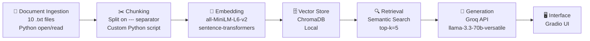

# Project 1 Planning: The Unofficial Guide

> Write this document before you write any pipeline code.
> Your spec and architecture diagram are what you'll use to direct AI tools (Claude, Copilot, etc.) to generate your implementation — the more specific they are, the more useful the generated code will be.
> Update the Retrieval Approach and Chunking Strategy sections if you change your approach during implementation.
> Update this file before starting any stretch features.

---

## Domain

<!-- What domain did you choose? Why is this knowledge valuable and hard to find through official channels? -->
My domain was the Hunter College CS Professor Reviews. This knowledge is valuable to students when registering for courses, students pick professors that previous students have rated, it is convinient for Hunter CS students to have all these ratings in one place without having to go to multiple RMP pages.

---

## Documents

<!-- List your specific sources: URLs, subreddit names, forum threads, or file descriptions.
     Aim for at least 10 sources that together cover different subtopics or perspectives within your domain. -->

| # | Source |   Description | URL or location |
|---|--------|  -------------|-----------------|
| 1 | RMP    |Mneimneh Rating|https://www.ratemyprofessors.com/professor/926045|
| 2 | RMP    |Lynch Rating   |https://www.ratemyprofessors.com/professor/2505090|
| 3 | RMP    |Dietrich Rating|https://www.ratemyprofessors.com/professor/2674099|
| 4 | RMP    |Eric Rating    |https://www.ratemyprofessors.com/professor/257192|
| 5 | RMP    |Maryash Rating |https://www.ratemyprofessors.com/professor/1137095|
| 6 | RMP    |Oyewole Rating |https://www.ratemyprofessors.com/professor/2558461|
| 7 | RMP    |Shankar Rating |https://www.ratemyprofessors.com/professor/257190|
| 8 | RMP    |Shostak Rating |https://www.ratemyprofessors.com/professor/1823870|
| 9 | RMP    |Stamos Rating  |https://www.ratemyprofessors.com/professor/64427|
| 10| RMP    |Tojeira Rating |https://www.ratemyprofessors.com/professor/1660967|

---

## Chunking Strategy

<!-- How will you split documents into chunks?
     State your chunk size (in tokens or characters), overlap size, and explain why those
     numbers fit the structure of your documents.
     A review-heavy corpus warrants different chunking than a long FAQ. -->

**Chunk size:**

One review per chunk (it splits on --- separator), roughly 50-200 characters each

**Overlap:**

No overlap

**Reasoning:**

Reviews are short and independent. Each one expresses a complete opinion. Splitting mid-review would lose context.

---

## Retrieval Approach

<!-- Which embedding model are you using (e.g., all-MiniLM-L6-v2 via sentence-transformers)?
     How many chunks will you retrieve per query (top-k)?
     If you were deploying this for real users and cost wasn't a constraint, what tradeoffs
     would you weigh in choosing a different embedding model — context length, multilingual
     support, accuracy on domain-specific text, latency? -->

**Embedding model:**
all-MiniLM-L6-v2 via sentence-transformers

**Top-k:**
5; with short reviews as chunks, retrieving 5 gives the LLM enough opinions to create an answer.

**Production tradeoff reflection:**
All-MiniLM-L6-v2 is good for local free use but its a small model trained on general text, not specifically on student slang or academic language, so it may be hard for the LLM to understand some of the "non-formal" reviews.
OpenAI's text-embedding-3-large would give better accuracy but costs money per API call.
Lastly, MiniLM is English only, this attribute may negatively impact results if reviews are written in other languages.
---

## Evaluation Plan

<!-- List your 5 test questions with their expected correct answers.
     Questions should be specific enough that you can judge whether the system's response
     is right or wrong. "What are good dining halls?" is too vague.
     "What do students say about wait times at [dining hall name] during lunch?" is testable. -->

| # | Question | Expected answer |
|---|----------|-----------------|
| 1 |Which CS professor is the best for discrete math?|Saad Mneimneh|
| 2 |Which CS professor is the best for CSCI 335?|Ioannis Stamos - highest rated, is helpful during office hours and provides generous curves|
| 3 |Which professors are the hardest to reach out to?|Professor Lynch, Oyekoya, and Shankar. Multiplie reviews mention no response from them|
| 4 |Who is better for Computer Architecture 2, Shankar or Shostak?|Shostak is the better pick. He is higher rated, clearer lectures, lets you replace midterm with final.|
| 5 |Which professor is the worst for CSCI 335?|Dietrich - reviews mention erasing interest in the subject, no useful final review.|

---

## Anticipated Challenges

<!-- What could go wrong? Name at least two specific risks with reasoning.
     Consider: noisy or inconsistent documents, missing source attribution, off-topic
     retrieval, chunks that split key information across boundaries. -->

1.

One of the anticipated challenges would have to be the contradicting reviews for the professors. It can be hard for my system to come up with a clear answer when there are the same amount of good reviews as bad for a professor.

2.

Another challenge present is the fact that some of the reviews in RateMyProfessor can be too short or "informal" meaning they use slang vocabulary in the review. This can present a challenge for the LLM to understand or even create a significant conclusion.

---

## Architecture

<!-- Draw a diagram of your pipeline showing the five stages:
     Document Ingestion → Chunking → Embedding + Vector Store → Retrieval → Generation
     Label each stage with the tool or library you're using.
     You can use ASCII art, a Mermaid diagram, or embed a sketch as an image.
     You'll use this diagram as context when prompting AI tools to implement each stage. -->

---

## AI Tool Plan

<!-- For each part of the pipeline below, describe:
     - Which AI tool you plan to use (Claude, Copilot, ChatGPT, etc.)
     - What you'll give it as input (which sections of this planning.md, which requirements)
     - What you expect it to produce
     - How you'll verify the output matches your spec

     "I'll use AI to help me code" is not a plan.
     "I'll give Claude my Chunking Strategy section and ask it to implement chunk_text()
     with my specified chunk size and overlap" is a plan. -->

**Milestone 3 — Ingestion and chunking:**
I will give Claude my Domain section, Documents table, and Chunking Strategy section from planning.md and ask it to implement a script that loads all .txt files from the /documents folder, splits them on the "---" separator, and returns a list of chunks with the source filename attached as metadata. I will verify the output by printing 5 random chunks and confirming they are readable, self-contained, and correctly labeled with their source file. 

**Milestone 4 — Embedding and retrieval:**
I'll give Claude the Retrieval Appraoch section and Architecture diagram and ask it to implement,an embedding script using all-MiniLM-L6-v2 via sentence-transformers that stores chunks in ChromaDB with source metadata, and a retrieval function that accepts a query string and returns the top-5 most relevant chunks with their source filenames. I will verify by running 3 of my evaluation plan questions and checking that returned chunks are visibly relevant.

**Milestone 5 — Generation and interface:**
I will give Claude my grounding requirement and ask it to implement a Groq API call using 
llama-3.3-70b-versatile with a system prompt that enforces grounding, and a 
Gradio UI with a text input and two output fields for the answer and sources. 
I will verify by testing an out-of-scope question and confirming the system 
declines to answer rather than hallucinating.
